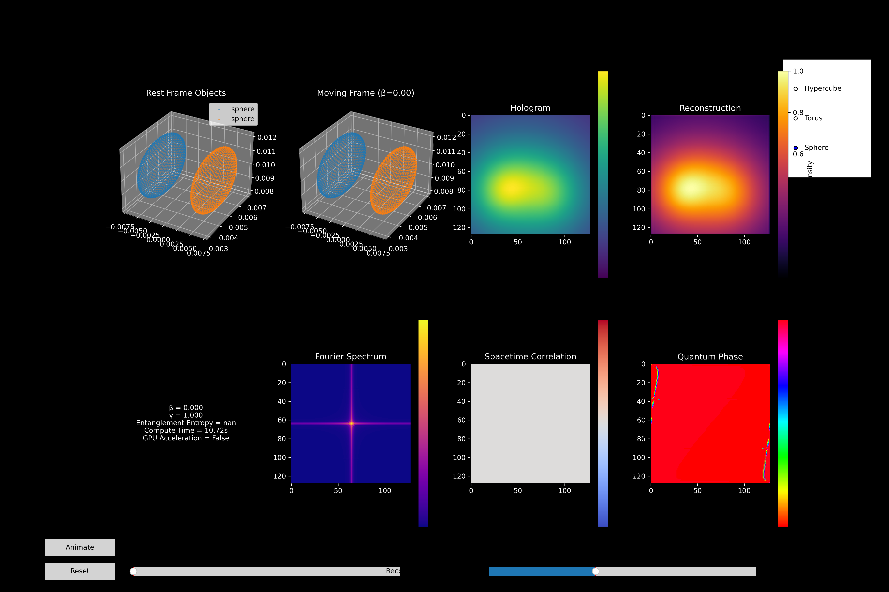

# RELATIVITY-IN-HOLOGRAMS

A Python project to simulate holographic reconstruction of relativistic objects, combining optics, quantum effects, and special relativity. The project generates dynamic holograms, reconstructs 3D object fields, and visualizes entanglement metrics in real-time.

🌀 **Fun fact:** To me, coding feels like wave interference, sometimes constructive, sometimes destructive but physics is always the best lens to reveal the hidden beauty of the universe.
## Abstract
We introduce an interactive, GPU-accelerated framework for real-time visualization of relativistic and quantum-informed holography. Our tool constructs point-cloud representations of canonical shapes (hypercube, spacetime torus, sphere) and applies full Lorentz transformations incorporating length contraction and Doppler-shifted quantum phases—to simulate their appearance in a moving reference frame. These transformed objects generate a phase-encoded hologram via angular spectrum propagation, which is then digitally reconstructed at user-defined distances. Eight synchronized panels display 3D rest- and moving-frame views, hologram intensity, reconstructed wavefront, Fourier spectrum, spacetime correlations, quantum phase maps, and entanglement entropy metrics. Responsive sliders for β = v/c and reconstruction distance, along with shape selectors and animation controls, deliver an immersive exploratory environment. By seamlessly integrating relativistic kinematics, quantum phase dynamics, and holographic imaging backed by optional CuPy GPU acceleration this project offers a powerful research and teaching platform for photonics, quantum information science, and high-energy optics.

## Project Importance and Positive Contributions
## 1. 	Bridging Theory and Visualization
• Translates abstract relativistic and quantum concepts into tangible 3D and 2D visualizations.
• Empowers researchers and students to observe length contraction, Doppler phase shifts, and entanglement entropy in real time.
## 2. 	Multimodal Insight
• Combines geometric (3D point clouds) and wave-optical (holography, Fourier analysis) perspectives.
• Reveals how object motion and quantum state affect hologram formation and reconstruction.
## 3. 	Interactive Exploration
• Sliders and controls enable on-the-fly manipulation of velocity (β), propagation distance (z), and object geometry.
• Animation routines illustrate continuous transitions, deepening intuition.
## 4  . 	Advanced Metrics
• Calculates entanglement entropy and polarization effects, integrating quantum information measures into an optical imaging context.
• Displays spacetime correlation maps to highlight relativistic coherence phenomena.
## 5. 	Performance and Scalability
• Optional CuPy support leverages GPU acceleration for large-scale arrays and smooth interactivity.
• Modular design allows extension to additional shapes, materials, or quantum observables.
## 6. 	Educational and Research Utility
• Serves as a hands-on teaching tool in graduate courses on photonics, holography, and quantum optics.
• Provides a testbed for prototyping new wavefront encoding schemes and relativistic imaging algorithms.
## 7. 	Open-Source Innovation
• **MIT:** licensed codebase invites community contributions, fostering collaboration at the intersection of computational physics and scientific visualization.
• Readily adaptable for simulation studies in biomedical optics, remote sensing, and quantum communication.
By unifying relativistic kinematics, quantum phase dynamics, and holographic reconstruction within a single, interactive application, this project exemplifies the next generation of computational imaging platforms ideal for both cutting-edge research and immersive pedagogy.

**Preview of output**:

# 🌌 Interactive Relativistic Holography & Quantum Phase Visualizer

## Project Overview
This repository bundles three core components:
1. **RelativisticObject**  
   - Generates point-clouds for hypercube, torus, and sphere geometries  
   - Applies Lorentz transforms (length contraction, Doppler phase shifts)  
   - Encodes optical response (reflectivity, transmissivity, phase shift)

2. **HolographySimulator**  
   - Builds a phase-encoded hologram by superposing transformed object wavelets with a reference wave  
   - Performs angular-spectrum reconstruction at variable distances  
   - Supports GPU acceleration via CuPy (fallback to NumPy)

3. **InteractiveVisualizer**  
   - Eight-panel UI:  
     1. 3D Rest-Frame Objects  
     2. 3D Moving-Frame Objects  
     3. Hologram Intensity  
     4. Reconstructed Wavefront  
     5. Quantum & Relativistic Metrics (β, γ, entanglement entropy, compute time)  
     6. Fourier Spectrum  
     7. Spacetime Correlation Map  
     8. Quantum Phase Map  
     Sliders: β (v/c), reconstruction distance (z)  
    Buttons: Reset, Animate, Shape selector (Hypercube, Torus, Sphere)  
     Live updates with timing and GPU acceleration indicators

## Key Features
- **Relativistic Visualization**: Observe length contraction and Doppler-shifted quantum phases in moving frames.  
- **Holographic Imaging**: Generate and reconstruct phase-encoded holograms via angular spectrum propagation.  
- **Quantum Metrics**: Compute and display entanglement entropy, polarization, and spacetime correlations.  
- **Fourier Analysis**: Inspect hologram’s frequency spectrum in real time.  
- **GPU Acceleration**: Leverage CuPy (if installed) for high-performance array operations.  
- **Interactive UI**: Real-time sliders and buttons for seamless exploration.

## Concepts Illustrated
• 	Relativistic length contraction & Doppler phase shifts
• 	Quantum phase encoding & entanglement entropy
• 	Angular spectrum propagation & digital holography
• 	GPU-accelerated numerical computing (CuPy)
• 	Interactive 3D and 2D scientific visualization

## Research Relevance
This tool showcases advanced competencies in:
• 	Translating relativistic and quantum phenomena into code
• 	Designing real-time, interactive simulations for theoretical exploration
• 	Developing holographic imaging and inverse reconstruction algorithms
• 	Leveraging GPU acceleration for scalable scientific tools
## Author
Developed by Alhassan Kpahambang Fuseini

## License
This project is licensed under the MIT License. Feel free to use, modify, and distribute with proper attribution.
